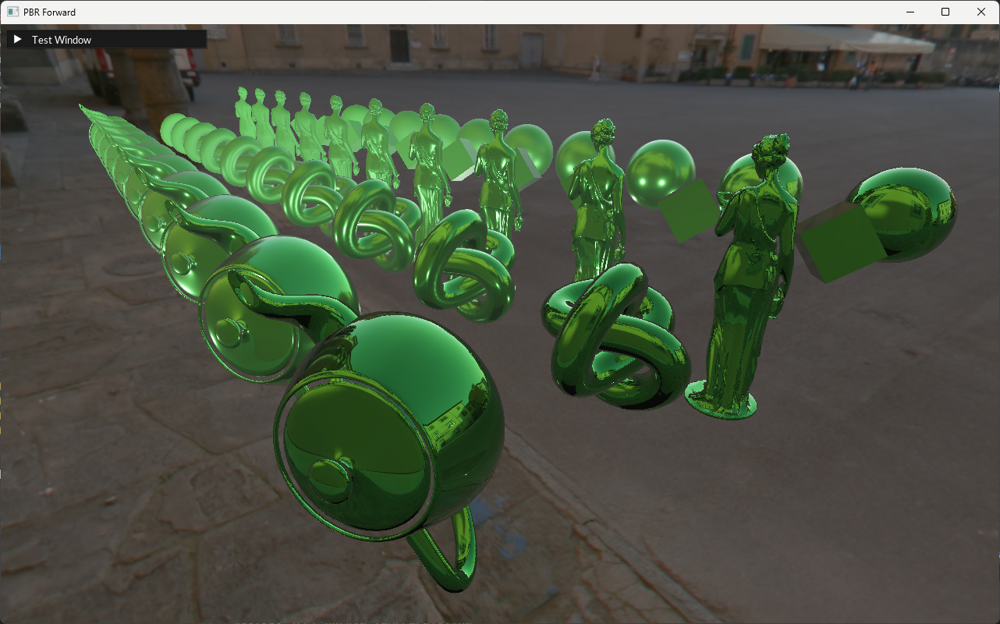
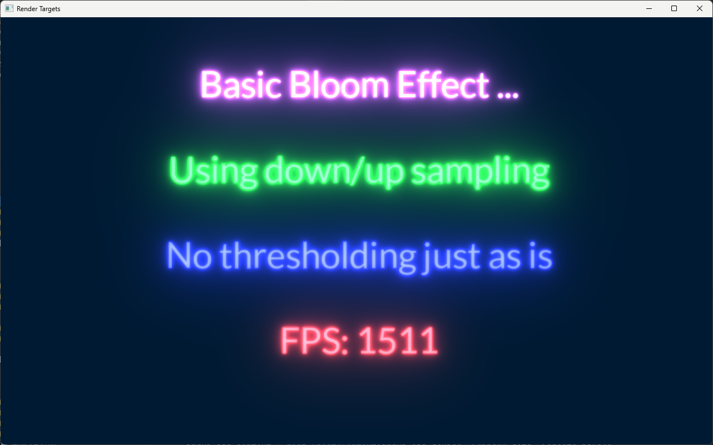

# Zest

## A Lightweight Single-Header Rendering Library

Zest is a minimal, zero-bloat rendering library written in c that tames modern GPU APIs like Vulkan. It handles synchronization, barriers, image transitions, and resource management through a clean C API, letting you focus on what you actually want to render.

In it's current state I would say that it's an early but usable version, there will definitely be shortcomings and bugs so please report any issues!

This is a more forward looking renderer currently in that it supports bindless descriptors and dynamic render passes, this is mainly supported by GPUs from 2014/15 onwards. I'll probably try and address this with other platform layers in the future though.

### Features

- **Minimal Setup**: drop `zest.h` and `zest_[platform]' (currently vulkan only)  into your project and go
- **Frame graph compiler**: declare passes and resources; Zest handles barriers, semaphores, pass culling, async queue scheduling, and transient memory automatically
- **Bindless descriptors**: one global descriptor layout, resources indexed by handle
- **Dynamic rendering**: Vulkan 1.3 dynamic render passes, no baked render pass objects
- **TLSF memory allocator**: low-fragmentation allocator for both CPU and GPU memory to keep memory usage neat and tidy.
- **Multi-window support**: one device, multiple contexts (swapchains)
- **Cross-platform**: Windows, Linux, macOS (currently via MoltenVK)

### Who is this for?

I wrote this renderer because I wanted something simple and straightforward that I could use for all my current and future projects. 

Zest is for developers who understand rendering pipelines and shaders but don't want to wrangle thousands of lines of Rendering API (like Vulkan) boilerplate. If you want a minimal-dependency layer that stays out of your way while handling the tedious parts of modern GPU programming, Zest is a good fit.

You should be comfortable with concepts like vertex buffers, pipelines, descriptor sets, and render passes. Zest doesn't abstract these away it makes them manageable. 

### Current Requirements

The current requirements will change overtime as I add more platform layers like DirectX, Metal and maybe even opengl to target much older graphics cards but I'm not sure right now.

| Requirement | Minimum |
|-------------|---------|
| Vulkan | 1.2 |
| GPU Features | Bindless descriptors, dynamic rendering, synchronization 2 |
| C Standard | C11 (also compiles as C++) |
| CMake | 3.7+ |

Supported windowing libraries in the API (But it's easy to add anything else you want): **GLFW** and **SDL2**

<!--
### Screenshots

| | |
|:---:|:---:|
|  |  |
| PBR Forward Rendering | Cascaded Shadow Maps |
|  |  |
| TimelineVFX Particles | PBR Deferred Rendering |
-->

## Getting Started

### Integration

Add `zest.h` and `zest_vulkan.h` to your project. In **exactly one** source file, define the implementation macros before including:

```cpp
#define ZEST_IMPLEMENTATION
#define ZEST_VULKAN_IMPLEMENTATION
#include <zest.h>
```

Optionally include `zest_utilities.h` for helpers like image loading, font rendering, and GLFW/SDL2 window setup. This file is there to support the examples but also serves as an example of how to use the API in various ways.

### Building the Examples

```bash
# Configure
cmake -B build

# Build
cmake --build build --config Release

# Run the minimal example
./build/examples/SDL2/Release/zest-minimal-template
```

Optional CMake flags:

| Flag | Description |
|------|-------------|
| `-DZEST_ENABLE_SLANG=ON` | Enable the Slang shader compiler (requires `VULKAN_SDK` env var) |

### Frame Graph Example

The frame graph is the core of Zest. You declare what you want to happen, and the compiler figures out how to execute it efficiently:

```c
zest_BeginFrameGraph(context);

    // Import the swapchain as a resource the graph can write to
    zest_resource swap = zest_ImportSwapchainResource(context, "backbuffer");

    // Declare a render pass
    zest_BeginRenderPass(context, "main");
        zest_ConnectSwapChainOutput(context, swap);
        zest_SetPassTask(context, my_render_callback, user_data);
    zest_EndPass(context);

zest_EndFrameGraphAndExecute(context);
```

The compiler automatically inserts barriers, manages image layout transitions, handles semaphore signaling between passes, and culls unused passes. Frame graphs can be cached with `zest_InitialiseCacheKey()` to avoid recompilation when the graph structure doesn't change.

### Multi-Pass Example

```c
zest_BeginFrameGraph(context);

    zest_resource swap    = zest_ImportSwapchainResource(context, "backbuffer");
    zest_resource depth   = zest_AddTransientImageResource(context, "depth", &depth_desc);
    zest_resource gbuffer = zest_AddTransientImageResource(context, "gbuffer", &gbuffer_desc);

    // Geometry pass -- writes gbuffer and depth
    zest_BeginRenderPass(context, "geometry");
        zest_ConnectOutput(context, gbuffer);
        zest_ConnectOutput(context, depth);
        zest_SetPassTask(context, geometry_pass, user_data);
    zest_EndPass(context);

    // Lighting pass -- reads gbuffer, writes to swapchain
    zest_BeginRenderPass(context, "lighting");
        zest_ConnectInput(context, gbuffer);
        zest_ConnectInput(context, depth);
        zest_ConnectSwapChainOutput(context, swap);
        zest_SetPassTask(context, lighting_pass, user_data);
    zest_EndPass(context);

zest_EndFrameGraphAndExecute(context);
```

Transient resources are automatically allocated, aliased where possible, and freed at the end of the frame.

In your pass task callback you might have something like:

```c
void DrawSprites(zest_command_list command_list, void *user_data) {
	ComputeExample *app = (ComputeExample*)user_data;
	//Retrieve the pipeline
	zest_pipeline pipeline = zest_GetPipeline(app->particle_pipeline, command_list);
	//Bind it
	zest_cmd_BindPipeline(command_list, pipeline);
	//Set and send push constants for bindless descriptor lookups in the shader
	ParticlePushConsts push;
	push.particle_index = app->particle_image_index;
	push.gradient_index = app->gradient_image_index;
	push.sampler_index = app->sampler_index;
	zest_cmd_SendPushConstants(command_list, &push, sizeof(ParticlePushConsts));
	zest_cmd_SetScreenSizedViewport(command_list, 0.f, 1.f);
	//Bind the vertex buffer
	zest_cmd_BindVertexBuffer(command_list, 0, 1, app->particle_buffer);
	//Make the drawcall
	zest_cmd_Draw(command_list, PARTICLE_COUNT, 1, 0, 0);
}
```

## Current to do

I'm using this library to develop my particle effects editor and library (TimelineFX) and so the next thing on my list will be to refactor that to update it this new renderer version, and so that will probably mean I have to tweak Zest as I find new bugs along the way. Other then that I'd like to:

- Implement profiling for cpu and gpu.
- Shader hot reloading.
- There's a few more examples/tests I'd like to write to test more functionality.
- Other platform layers: DirectX 12, Metal and maybe WebGPU and even opengl if it makes sense.

## Project Structure

```
zest.h                  Main API (~16K lines)
zest_vulkan.h           Vulkan backend (~5K lines)
zest_utilities.h        Optional helpers to support the examples. (image loading, fonts, GLFW/SDL2)
implementations/
  impl_imgui.cpp/h      Dear ImGui integration
  impl_timelinefx.h/c   TimelineVFX particle system
  impl_slang.hpp        Slang shader compiler support
examples/
  SDL2/                 Example projects (PBR, shadows, compute, particles, etc.)
```

### Included Examples

Credit to Sascha Willems for some of these examples where I re-implemented his original Vulkan examples in Zest.

For convenience all examples use SDL2 for the windowing, but you can use whatever you want. All examples are heavily commented so they're a good resource to learn how to use Zest.

| Example | Description |
|---------|-------------|
| `zest-minimal-template` | Bare-minimum setup |
| `zest-pbr-forward` | Physically-based forward rendering |
| `zest-pbr-deferred` | Deferred rendering pipeline |
| `zest-shadow-mapping` | Shadow maps |
| `zest-cascading-shadows` | Cascaded shadow maps |
| `zest-compute-example` | Compute shaders with Slang |
| `zest-fonts` | MSDF font rendering |
| `zest-instancing` | Instanced draw calls |
| `zest-render-targets` | Off-screen render targets |
| `zest-timelinefx` | Particle effects |
| `zest-vaders` | Space Invaders demo |
| `zest-imgui-template` | Dear ImGui integration |

## Architecture Overview

```
Application
    │
    ▼
┌─────────┐      ┌───────────┐     ┌───────────┐
│  Device  │─────▶│ Context A │     │ Context B │
│          │      │(Window 1) │     │(Window 2) │
│ Shaders  │      │           │     │           │
│ Pipelines│      │ FrameGraph│     │ FrameGraph│
│ Bindless │      │ Allocators│     │ Allocators│
│ Resources│      └───────────┘     └───────────┘
└─────────┘
```

**Device** -- One per application. Owns the Vulkan instance, GPU resources, shader library, pipeline templates, and the global bindless descriptor set.

**Context** -- One per window/swapchain. Manages frame resources, compiles and executes the frame graph.

## Links

Full documentation, tutorials, and API reference at **[peterigz.github.io/zest](https://peterigz.github.io/zest/)**

## License

MIT License. See [LICENSE](LICENSE) for details.